# GSM-DDC-Simulink-Model

[](https://www.mathworks.com/products/matlab.html) [](https://www.mathworks.com/products/simulink.html) [-lightgrey.svg)](https://www.mathworks.com/products/fixed-point-designer.html)

Simulink-модель цифрового преобразователя частоты вниз (DDC) для тракта мобильного GSM-приёмника: NCO-гетеродин, комплексное перемножение и каскад децимации CIC → CIC-компенсатор → FIR, с полным сопоставлением форматов данных `single` и `fixdt(1,16,14)` на каждой контрольной точке тракта.

**Методы и инструменты:** цифровой перенос спектра (DDC) с NCO (Numerically Controlled Oscillator) · анализ зон Найквиста при передискретизации АЦП · CIC-дециматор и CIC-компенсирующий фильтр (компенсация sinc-спада АЧХ) · синтез FIR-фильтра через `filterDesigner` · сравнение чисел с плавающей (`single`) и фиксированной (`fixdt(1,16,14)`, `fixdt(1,32,20)`) точкой · dithering как метод подавления паразитных гармоник квантования (spurs) ценой роста шумового пола

## Что демонстрирует проект

- **Собрал и верифицировал DDC-тракт целиком**, а не по частям: NCO → перемножитель → CIC → CIC-компенсатор → FIR, с контролем спектра на каждом узле через параллельные `Spectrum Analyzer`.
- **Нашёл и устранил реальную инженерную проблему**, а не просто выполнил методичку: в нативной ветке `fixdt(1,16,14)` из-за ограничения кратности NCO возникала расстройка по частоте — устранил её переходом через `single → fixdt(1,32,20)`, обосновав выбор разрядности минимально необходимой точностью.
- **Количественно сравнил форматы данных**: `single` vs `fixdt(1,16,14)` — по разрешению мантиссы, чистоте спектра и поведению при dithering.
- **Подобрал dither осознанно, а не по умолчанию**: 14 бит — компромисс, при котором паразитные выбросы полностью исчезают, а рост шумового пола ещё минимален.
- **Спроектировал FIR-фильтр под целевые параметры** (полоса 500 кГц при `Fs = 1,92 МГц`) в `filterDesigner`, а не использовал готовые коэффициенты.
- **Проверил каждое проектное решение расчётом**: несущая, ноль АЧХ CIC, ширина зоны Найквиста при альтернативной децимации компенсатора — везде число из модели сходится с числом по формуле.

## Оглавление

- [Результат работы](#результат-работы)
- [Постановка задачи](#постановка-задачи)
- [Архитектура модели](#архитектура-модели)
- [Формат данных: single vs fixdt(1,16,14)](#формат-данных-single-vs-fixdt11614)
- [Перемножитель: проверка и устранение расстройки](#перемножитель-проверка-и-устранение-расстройки)
- [Цепочка децимации](#цепочка-децимации)
- [Структура репозитория](#структура-репозитория)
- [Как открыть модель](#как-открыть-модель)
- [Известные особенности](#известные-особенности)
- [Лицензия](#лицензия)

## Результат работы

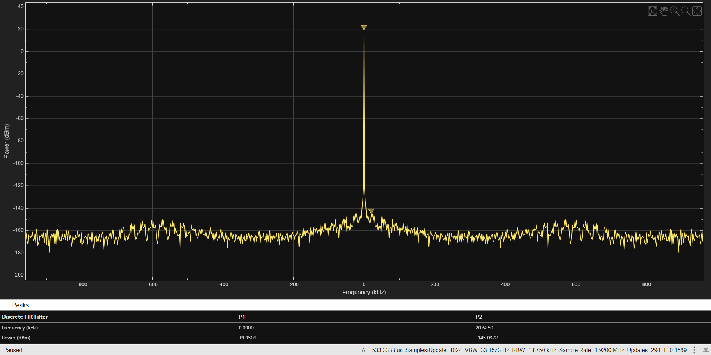

Итоговый спектр на выходе полного тракта DDC (Convert → CIC Decimator → CIC Compensation Decimator → Gain → FIR Decimation). Уровень шумов минимален, паразитные выбросы энергии отсутствуют, полезный сигнал сосредоточен чётким пиком на 0 Гц (сигнал перенесён в базовую полосу) с ожидаемым подавлением вне полосы.

| Параметр варианта | Значение |
| --- | --- |
| Частота дискретизации `Fs` | 122,88 MSPS |
| Коэффициент децимации `K` | 64 |
| Выходная полоса | 500 кГц |
| Несущая после переноса `fc` | 23,406 МГц |
| Первый ноль АЧХ CIC (`Fs/K`) | 1,92 МГц |

## Постановка задачи

Цель — освоить правила моделирования систем реального времени в Simulink на примере тракта DDC: собрать модель и промоделировать её работу с параметрами мобильного GSM-приёмника.

Числовые параметры тракта DDC: `Fs = 122,88 MSPS`, `K = 64`, выходная полоса 500 кГц, целевой формат на выходе DDC — `sfix(1,16,14)`. Частота сигнала гетеродина определяется как `Fs · K`.

АЦП работает в режиме передискретизации в первой зоне Найквиста, поэтому децимация выполняется цифровым трактом после АЦП, а не аналоговым фильтром на входе. Несущая переносится по правилу

```
fc = (m/n) · Fs,   m/n = 4/21   =>   fc = 4/21 · 122,88 МГц ≈ 23,406 МГц
```

Приращение фазы NCO на такт задаётся тем же отношением: `Δφ = (m/n) · 2³²`. Параметр `Samples per frame` выставлен равным общему коэффициенту децимации 64, что и определяет понижение скорости потока по цепочке.

## Архитектура модели

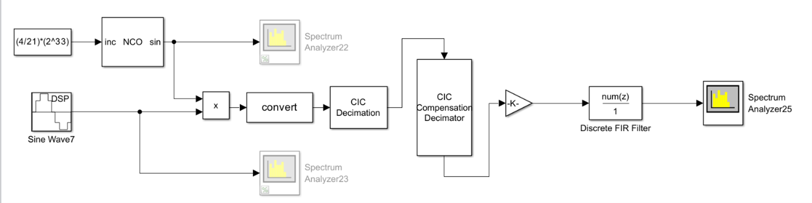

| Блок Simulink | Роль в тракте |
| --- | --- |
| `Constant`, `Sine Wave` | Формирование тестового входного сигнала на входе тракта |
| `NCO` (Numerically Controlled Oscillator) | Цифровой гетеродин, генерирует опорную частоту переноса по приращению фазы `Δφ` |
| `Product` | Комплексное перемножение сигнала и гетеродина — собственно перенос спектра вниз |
| `Data Type Conversion` | Приведение типа `single → fixdt(1,32,20)`, устраняющее рассогласование частот после перемножителя |
| `CIC Decimation` | Дециматор Cascaded Integrator-Comb, единственная ступень понижения частоты дискретизации в 64 раза |
| `CIC Compensation Decimator` | Компенсация sinc-спада АЧХ CIC в полосе пропускания, без дополнительной децимации (коэффициент = 1) |
| `Gain` + `Discrete FIR Filter` | Финальная фильтрация с коэффициентами, рассчитанными в `filterDesigner`, формирование итоговой полосы 500 кГц |
| `Spectrum Analyzer` (×24 в модели) | Контроль спектра на каждой контрольной точке тракта — вход, выход NCO, выход перемножителя, после каждого фильтра |

Модель анализировалась при помощи для формата данных `single` и для формата `fixdt(1,16,14)`.

## Формат данных: single vs fixdt(1,16,14)

Входные сигналы ограничены диапазоном ±1 В. В формате `fixdt(1,16,14)` это 1 знаковый бит + 1 бит на целую часть + 14 бит мантиссы; в `single` под мантиссу отведено 23 бита (при нулевом порядке `2⁰ = 1`) — отсюда заметно более высокое разрешение по амплитуде у `single`.

Для NCO в формате с фиксированной точкой ключевой компромисс — **dithering**:

| Без dither | С dither |
| --- | --- |
| 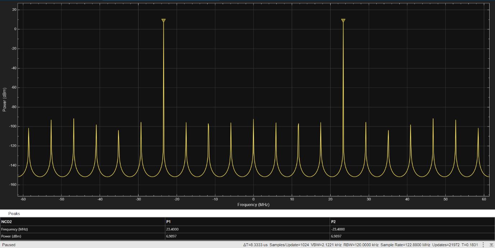 | 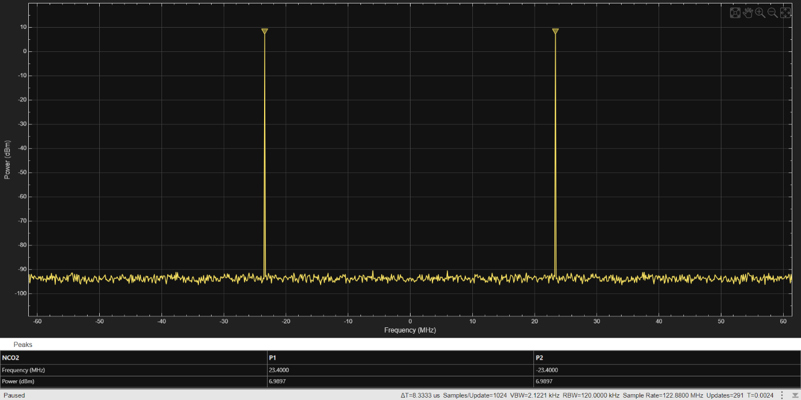 |
| Высокий уровень паразитных выбросов (spurs) от периодичности ошибки квантования фазы, но низкий шумовой пол | Паразитные выбросы исчезают — шум квантования становится некоррелированным шумом, — но шумовой пол заметно поднимается |

Число бит dither (`Number of dither bits`) в итоге подобрано равным 14 — минимум шумов при полном отсутствии видимых всплесков АЧХ. Для `single`-ветки спектр NCO также имеет высокий уровень паразитных выбросов (spurs): 
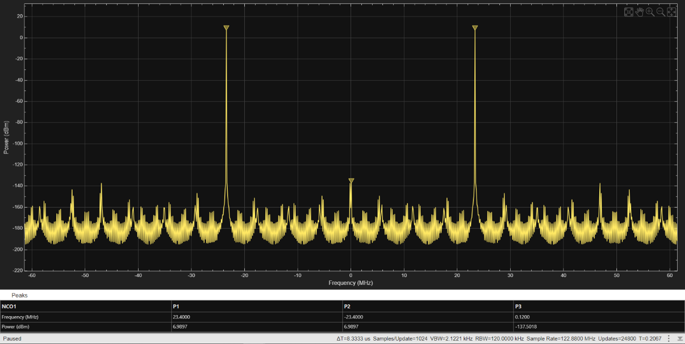

Отдельно отмечено: блок DSP-синусоиды в формате `fixdt(1,16,14)` требует, чтобы отношение частоты дискретизации к частоте сигнала было кратным целому числу. Кратность выбрана равной 4 (вместо точных 21/4), что и даёт видимую расстройку — вторую пару пиков в районе нулевой частоты на спектрограммах фиксированной точки.

## Перемножитель: проверка и устранение расстройки

Перед сборкой фильтров схема проверялась на корректность выноса спектра. После блока `Product` (перемножение NCO и Sine Wave) новые спектральные пики закономерно оказываются на удвоенных частотах относительно входных — это прямое следствие тригонометрического тождества произведения синусоид и первый индикатор того, что перенос спектра собран верно:

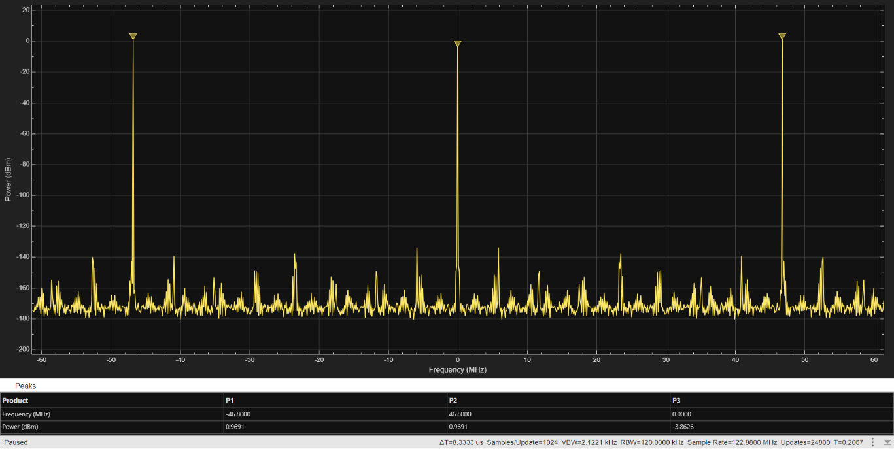

Для ветки `fixdt(1,16,14)` в спектре перемножителя проявляется та же расстройка, что и на выходе NCO — следствие приближения `4` вместо точного `21/4` в требовании кратности частоты дискретизации и сигнала для DSP-блока синуса:

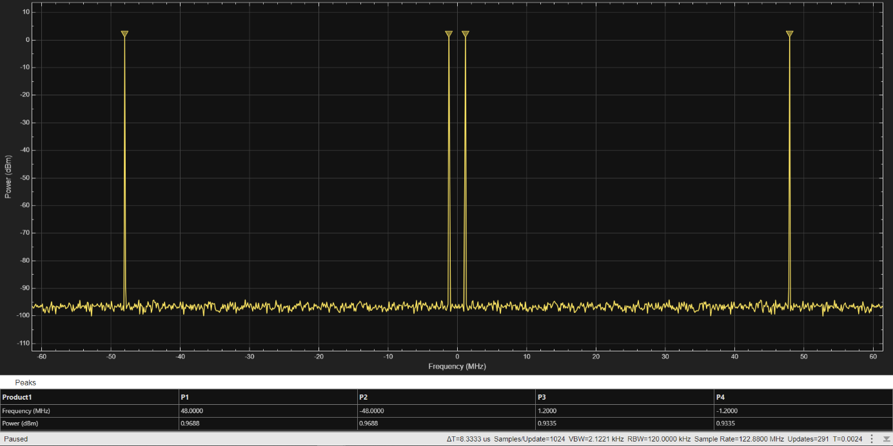

Поскольку у нативной 16-битной fixed-point ветки расстройка встроена в саму настройку блока и не убирается локально, для дальнейшей обработки (фильтрации и децимации) схема была перестроена: сигнал ведётся в `single` — формате без этого ограничения, — а затем конвертируется блоком `Data Type Conversion` в `fixdt(1,32,20)`. Это даёт фиксированную точку, пригодную для последующей аппаратной реализации, но с разрядностью, достаточной, чтобы ошибка кратности не проявлялась:

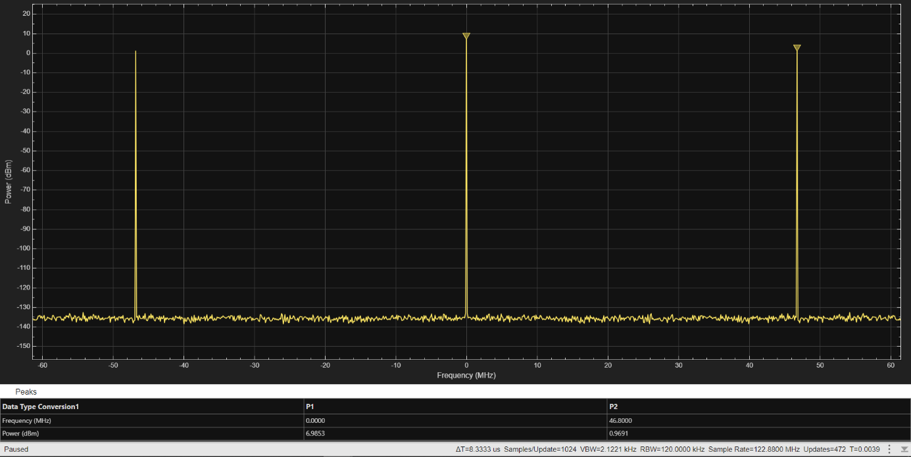

Таким образом `fixdt(1,32,20)` в этой модели — не произвольный выбор разрядности, а минимально необходимая точность, при которой рассогласование частот перестаёт быть заметным, а формат остаётся представимым в фиксированной точке.

## Цепочка децимации

После приведения типа (`single → fixdt(1,32,20)`) тракт понижает частоту дискретизации в 64 раза.

**1. CIC Decimator.** АЧХ фильтра:

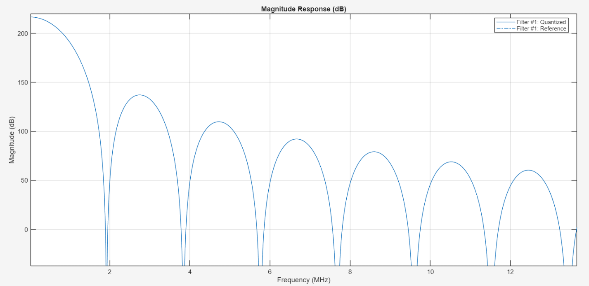

Первый ноль АЧХ приходится на ≈1,92 МГц, что соответствует расчётному `Fs/K = 122,88/64 = 1,92 МГц`.

**2. CIC Compensation Decimator.** Компенсирует sinc-спад CIC в полосе пропускания обратной по форме АЧХ:

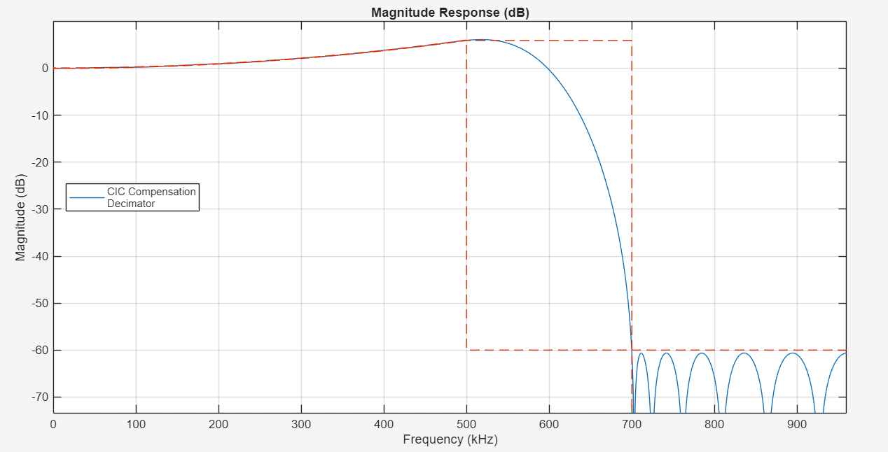

Компенсатору можно добавить собственную децимацию ×2 для сужения полосы перехода, но тогда первая зона Найквиста сузилась бы до 480 кГц вместо требуемых по условию 500 кГц — поэтому коэффициент децимации компенсатора оставлен равным 1.

**3. Gain + Discrete FIR Filter.** Финальный FIR спроектирован в `filterDesigner` под `Sample Frequency = 1,92 МГц`:

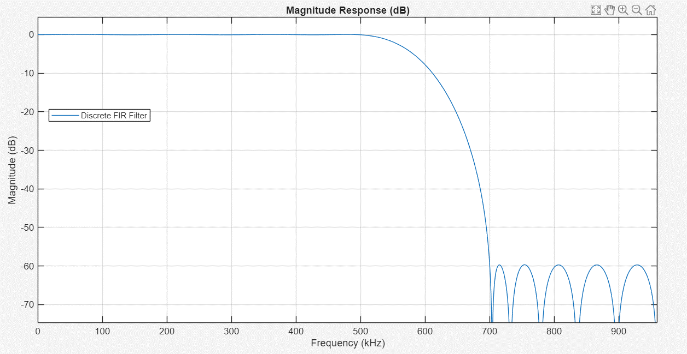

Коэффициенты рассчитаны интерактивно в `filterDesigner` (полоса пропускания и заграждения под требуемые 500 кГц при `Fs = 1,92 МГц`) и перенесены напрямую в параметры блока `Discrete FIR Filter` в модели:

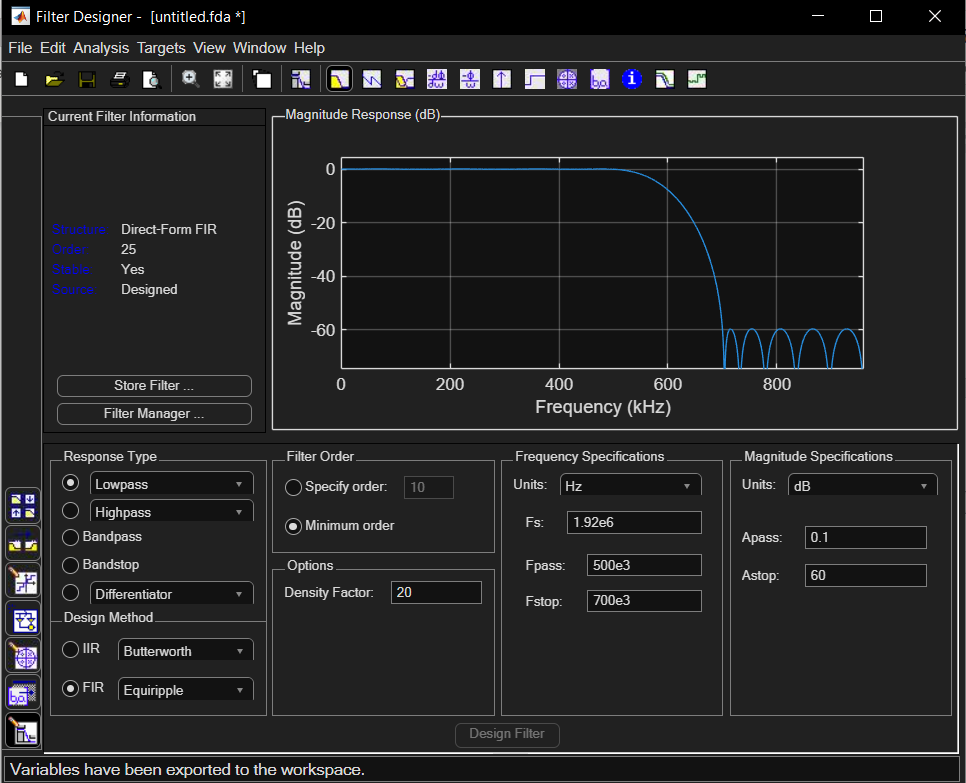

## Структура репозитория

```
.
├── gsm_ddc_model.slx           # Simulink-модель тракта DDC (single- и fixed-point ветки)
├── images/
│   ├── lab_variant_conditions.png
│   ├── model_top_level_scheme.png
│   ├── nco_spectrum_single.png
│   ├── nco_spectrum_no_dither.png
│   ├── nco_spectrum_dither.png
│   ├── mixer_output_freq_doubling.png
│   ├── mixer_output_detuned_fixdt.png
│   ├── mixer_output_corrected_after_convert.png
│   ├── cic_decimator_afc.png
│   ├── cic_compensation_afc.png
│   ├── fir_decimation_afc.png
│   ├── filterdesigner_fir_response.png
│   └── final_spectrum.png      # верифицирующий прогон, см. "Результат работы"
└── README.md
```

## Как открыть модель

Модель сохранена в MATLAB R2025a. Для полного воспроизведения потребуются:

- MATLAB + Simulink R2025a (или новее — модель, как правило, открывается и в более поздних релизах);
- **DSP System Toolbox** — блоки `NCO`, `Sine Wave`, `Spectrum Analyzer`, `CIC Decimation`, `CIC Compensation Decimator`, `Discrete FIR Filter`;
- **Fixed-Point Designer** — типы данных `fixdt(1,16,14)`, `fixdt(1,32,20)` и блок `Data Type Conversion` между ними.

```
open('gsm_ddc_model.slx')
```

## Известные особенности

- Кратность частоты дискретизации к частоте сигнала для DSP-синусоиды в нативной ветке `fixdt(1,16,14)` выбрана равной 4, а не точным 21/4 варианта — источник расстройки, специально показанной в разделе про форматы данных как иллюстрация ограничения 16-битной fixed-point арифметики. Для дальнейшей обработки (фильтрации/децимации) эта расстройка устранена переходом через `single → fixdt(1,32,20)`, см. [«Перемножитель: проверка и устранение расстройки»](#перемножитель-проверка-и-устранение-расстройки) — то есть итоговый тракт от неё не страдает.
- Коэффициент децимации CIC-компенсатора сознательно оставлен равным 1 — децимация ×2 сузила бы первую зону Найквиста ниже требуемых по варианту 500 кГц.
- Итоговый рабочий формат тракта — `fixdt(1,32,20)`, а не заданный в условии `sfix(1,16,14)`: более широкая разрядность выбрана как минимально достаточная, чтобы устранить ошибку кратности NCO, оставаясь при этом представимой в фиксированной точке.

## Лицензия

MIT.
